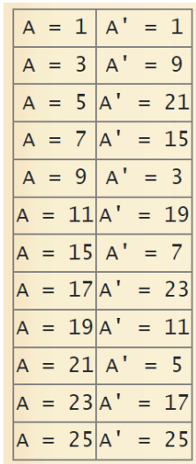

# Affin-sezar
Affin kriptotizimlari. Affin kripototizimlari keng tarqalmagan o‘rniga qo‘yish usullari sanalib, bir alfavitli shifrlash usullariga kiradi. Bu tizimlarga affin tizimidagi Sezar usuli, ROT13 va Atbash usullari kiradi.
Affin tizimidagi Sezar usulida har bir harfga almashtiriluvchi harflar maxsus formula bo‘yicha aniqlanadi:
E(x)=ax+b (modm),
bu yerda a, b - butun sonlar bo‘lib, kalitlar hisoblanadi, 0≤a, b<m. m – alfavit uzunligi. Deshifrlash jarayoni quyidagi formula asosida amalga oshiriladi:
𝑫(𝑬(𝒙)) = 𝒂-1 (𝑬(𝒙) − 𝒃)𝒎𝒐𝒅𝒎.
Bu yerda a -1 modm bo‘yicha a ga teskari bo‘lgan son. Lotin alfaviti foydalanilganda u quyidagicha raqamlanadi:		
 
Shifrlash. Ushbu usulda ma’lumotlarni shifrlash uchun “FARRUX” ochiq matni olinib, kalit sifatida a=3 va b=7 olindi. Alfavit uzunligi m=26 ga teng. Bu holda shifrlash funksiyasining umumiy ko‘rinishi quyidagicha bo‘ladi:
𝒚 = 𝑬(𝒙) = (𝟑𝒙 + 7)𝒎𝒐𝒅𝟐𝟔.
Yuqoridagi jadvalga asoslanib quyidagini olish mumkin:
Matn	F	A	R	R	U	X
O’rni	4	0	17	17	20	23
3x+7	22	7	58	58	67	76
(3x+7)mod26	22	7	6	6	15	24
Shifr matn	W	H	G	G	P	Y

Deshifrlash jarayoni. Deshifrlash formulasi 𝑫(𝒚) = 𝒂 -1 (𝒚 − 𝒃)𝒎𝒐𝒅𝒎 ga teng bo‘lib, 𝑎-1 = 9, b=7 va m=26 ga teng bo‘ladi

